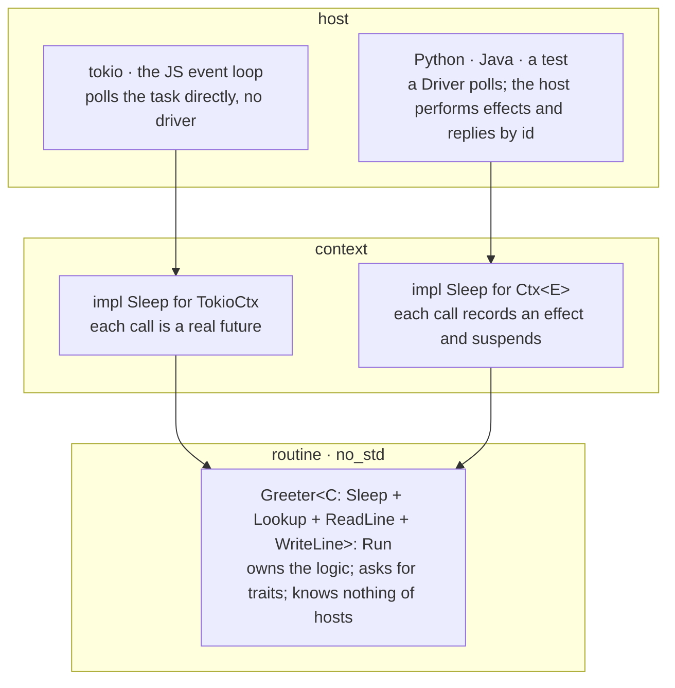

# sans-effort

> _sans-io, without all the effort_

[](https://github.com/inkandswitch/sans-effort/actions/workflows/test-host.yml) [](LICENSE-MIT) [](https://docs.rs/sans-effort)

`sans-effort` lets you write ordinary, "direct-style" Rust (`async fn`, `.await`, loops, `?`, etc) and run it two ways:

1. Call it from Rust as normal: on `tokio` it is a plain future at native speed, with no driver.
2. Drive it from a FFI host language through a sans-io interface: every wait becomes a typed effect that the host answers by id, so the host owns I/O, time, and scheduling — which routine resumes, in what order replies arrive, whether the clock is real or virtual — and the output is typically byte-identical to the native run.

The routine asks for traits, not effects, and cannot tell which way it is running. The compiler writes the state machine; the only `Pin` is one `Box::pin` at any FFI boundary (if and when it exists).

This repo contains the library. The research exploration including alternatives built out and measured live in [`effect-routines-exploration`][exploration]:

[exploration]: https://tangled.org/expede.wtf/effect-routines-exploration
[guide]: https://tangled.org/expede.wtf/effect-routines-exploration/raw/main/guide/how-to-write-effect-routines.pdf
[analysis]: https://tangled.org/expede.wtf/effect-routines-exploration/blob/main/analysis/README.md
[compare]: https://tangled.org/expede.wtf/effect-routines-exploration/tree/main/compare
[bench]: https://tangled.org/expede.wtf/effect-routines-exploration/tree/main/hosts/bench

## Three Layers



The routine is the foundation and depends on nothing above it. The native path is why you write it this way: the routine is also an ordinary library function. The driven path is what these crates provide.

## The Routine

```rust
use sans_effort_effects::{console::{ReadLine, WriteLine}, time::Sleep};  // the standard library

pub trait Lookup { async fn lookup(&self, name: String) -> String; }      // the application's own

impl<C: Sleep + Lookup + ReadLine + WriteLine> Run for Greeter<C> {
    async fn step(&mut self) -> ControlFlow<()> {
        self.ctx.write_line("Who are you?".into());
        let Ok(name) = self.ctx.read_line().await else {                  // input can end
            return ControlFlow::Break(());
        };
        let greeting = self.ctx.lookup(name.clone()).await;
        self.ctx.sleep(PAUSE).await;
        self.ctx.write_line(format!("{greeting}, {name}!"));
        ControlFlow::Continue(())
    }
}
```

## Two Contexts, One Routine

Natively, on tokio — no driver, no effects, tokio polls the task:

```rust
impl Sleep for TokioCtx {
    async fn sleep(&self, d: Duration) { tokio::time::sleep(d).await }
}
// …
tokio::spawn(Greeter::new(TokioCtx::new(stdin)).run());
```

Behind a host — each call records a request and suspends until the host replies by id. The context is generic over the host's vocabulary `E`, so a host can offer a routine _less_ than everything, and the type system enforces it:

```rust
// in sans-effort-effects, written once for every application:
impl<E: From<Asked<effect::Sleep>>> Sleep for Ctx<E> {
    async fn sleep(&self, d: Duration) { self.request(effect::Sleep(d)).await }
}
// …
Driver::<Full>::new(|outbox| Greeter::new(Ctx::new(outbox)).run());   // ok
Driver::<Quiet>::new(|outbox| Greeter::new(Ctx::new(outbox)).run());  // E0277: Ctx<Quiet>: Lookup
Driver::<Quiet>::new(|outbox| Ticker::new(Ctx::new(outbox), 3).run()); // ok: Ticker needs only Sleep + WriteLine
```

`demo/` has all of this in full — the greeter, the ticker, both contexts, native hosts on tokio and on Node (wasm-bindgen), and a C-ABI binding driven from Python (ctypes) and Java (Panama) — and `nix develop` then `demo` runs all four and checks the transcripts are byte-identical.

### Where This Sits

This is the [tagless-final][tf] style with the representation pinned to `impl Future`: the traits are the algebra, a routine is a term abstract in its interpreter, `TokioCtx` is the evaluating interpreter, and `Ctx<E>` is the reifying one — the instance that recovers the initial, tagged encoding (`Full`) from the final one. `Quiet` is a smaller algebra. Rust readers may know the same shape as "capability traits" or MTL-style; the effects style, where the routine emits a tagged enum directly, is the initial encoding, and the two share one mechanism because initial and final encodings are interconvertible. Rust has no higher-kinded types, so the representation cannot vary; the interpreter does.

[tf]: https://okmij.org/ftp/tagless-final/index.html

## How a Host Drives a Routine

```text
  host                                    routine
    │                                         │
    │  start()                                │
    │────────────────────────────────────────▶│ run until input needed
    │                                         │ 
    │        [WriteLine, (ReadLine, 1)]       │
    │◀────────────────────────────────────────🮘
    │                                         🮘 AWAITING
    │             reply(1, "bob")             🮘
    │────────────────────────────────────────▶🮘 
    │                                         │
    │              [(Lookup, 2)]              │
    │◀────────────────────────────────────────🮘 
    │                                         🮘 AWAITING
    │             reply(2, "Hello")           🮘
    │────────────────────────────────────────▶🮘 
    │                                         │
    │  [WriteLine]                            │
    │◀────────────────────────────────────────│ COMPLETE
    │                                         ┴
```

- _Pull-only._ The routine asks for everything it needs, but by _returning_ an effect from `start`/`reply`, never by calling the host. No callbacks, no upcalls, so no foreign value ever enters a Rust frame — which is why the routine is `Send` for free.
- _Typed replies._ Every awaiting effect carries a `ReplyHandle<T>`: the typed, single-use capability to answer it. A Rust host replies through the handle, infallibly; a foreign host replies by id, and the host layer checks the kind.
- _Many waits outstanding._ Requests carry ids, so a routine may `join` two waits — or `select` the first of them — and a host may reply in any order. A request the routine abandons is reported to the host, which may stop the work.
- _`no_std` core._ The mechanism, the routine, and its boundary crate all build for `wasm32`; the mechanism for `thumbv6m` with `critical-section`.

## Crates

| Crate                                         | Purpose                                                                                                                                                                                          | Target             |
|-----------------------------------------------|--------------------------------------------------------------------------------------------------------------------------------------------------------------------------------------------------|--------------------|
| [`sans-effort`](sans-effort/)                 | The mechanism: `Run`, `Outbox`, `ReplyHandle`, `Request`, `Driver`, `join`, `select`, the reply menu, `boundary`, `testing`                                                                      | `no_std` + `alloc` |
| [`sans-effort-effects`](sans-effort-effects/) | A standard library of capabilities: `time` (`Sleep`) and `console` (`ReadLine`, `WriteLine`) — the traits, their effects, and the reifying `Ctx<E>`, written once                                | `no_std` + `alloc` |
| [`sans-effort-tokio`](sans-effort-tokio/)     | Native tokio contexts: one component per capability — `TokioClock` (`Sleep`), `TokioInput` (`ReadLine`), `TokioOutput` (`WriteLine`) — and `TokioCtx` with all of them — real futures, no driver | `std`              |
| [`sans-effort-host`](sans-effort-host/)       | The host side for foreign hosts: a typed `Machine`, the `Encoded` byte layer, a handle table, panic isolation. No `unsafe`                                                                       | `std`              |
| [`ABI.md`](ABI.md)                            | The contract a foreign host assumes                                                                                                                                                              | —                  |
| [`design/`](design/)                          | How it works and why: assumptions, the effects stdlib, channels, capabilities, cancellation                                                                                                        | —                  |
| [`demo/`](demo/)                              | The greeter and ticker; native contexts for tokio and for JS (wasm-bindgen, no driver); a reifying context with `Full`/`Quiet` vocabularies; a C-ABI binding driven from Python and Java         | —                  |

### Next

Channels in the standard library (`Open`, `Post`, `Receive`, `Spawn`), with their native side in `sans-effort-tokio`; a derive for the `View`/`Encode` restatement. The demo grows routines that spawn and message each other, with each host's loop as the scheduler.

### Not Here, on Purpose

A scheduler inside the library (the host is the scheduler, whichever host it is); supervision and linking; deadlock levels; language-side host SDKs beyond the demo; `pyo3`/`rustler` bindings. Each is a natural next layer; none is needed to use what is here.

## Development

```sh
nix develop   # dev shell with a command menu
menu          # list project commands: ci:full, demo, test:no_std, …
```

Without Nix, `rust-toolchain.toml` pins the toolchain for `rustup`; the demo's hosts need Python 3, a JDK with `java.lang.foreign` (25), Node, and `wasm-bindgen-cli` at the version pinned in `Cargo.toml`.

## License

Licensed under either of

- Apache License, Version 2.0 ([LICENSE-APACHE](LICENSE-APACHE))
- MIT license ([LICENSE-MIT](LICENSE-MIT))

at your option.
