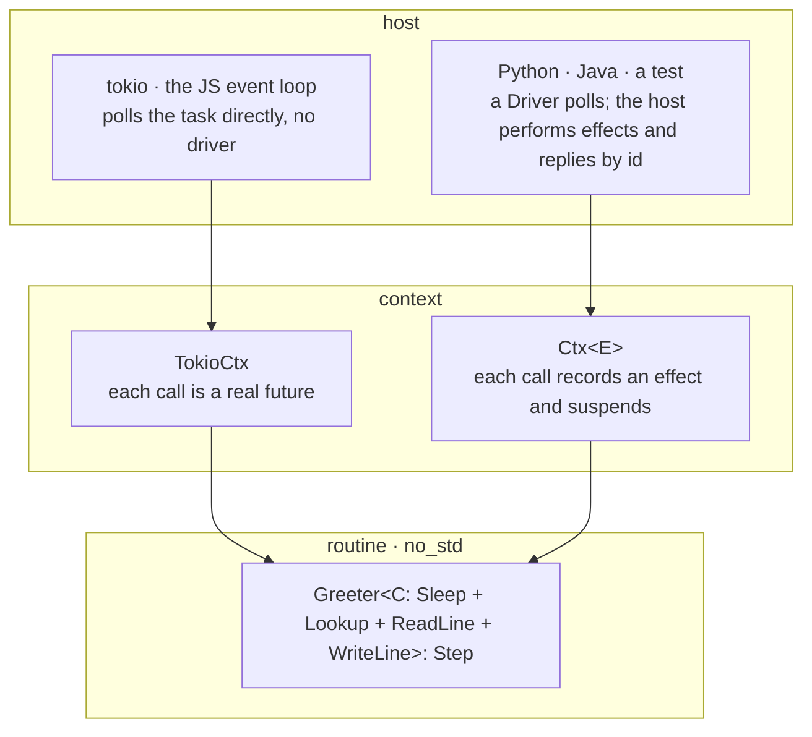
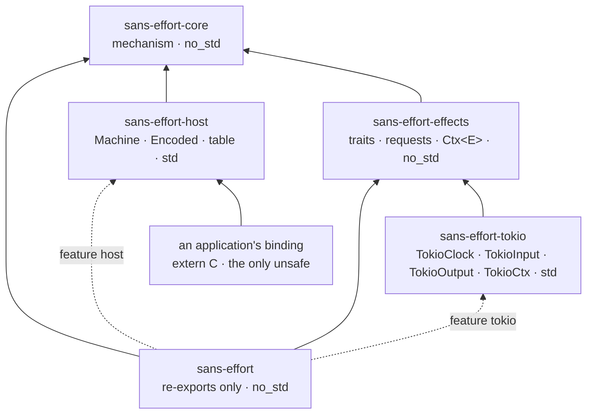
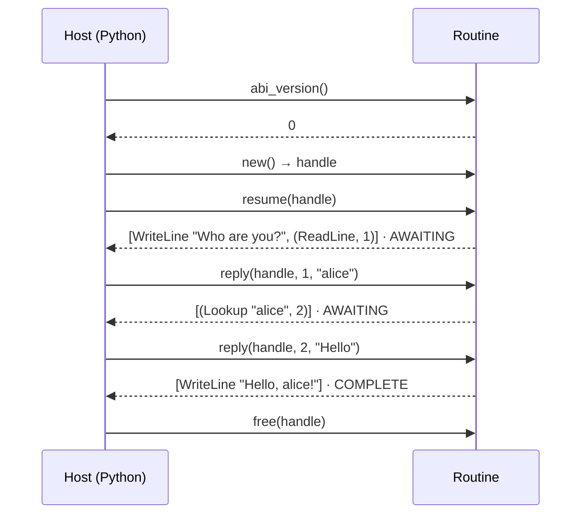

# Design

This directory explains how `sans-effort` works and why, less formally than a specification. [`ABI.md`](../ABI.md) at the repository root is the normative contract for foreign hosts; these documents are the reasoning around it.

Some documents describe what exists and some describe what is planned. Each one says which at the top.

## Documents

| Document                          | Status            | Purpose                                                                        |
|-----------------------------------|-------------------|--------------------------------------------------------------------------------|
| [`assumptions`](assumptions.md)   | current + planned | What the design assumes about hosts, routines, and targets                     |
| [`effects`](effects.md)           | current + planned | A standard library of effect traits: `sans-effort-effects`, `sans-effort-tokio` |
| [`channels`](channels.md)         | planned           | Plain channels between machines, spawning, and the host as the scheduler       |
| [`capabilities`](capabilities.md) | planned           | Object-capability discipline within a process, given an honest host            |
| [`cancellation`](cancellation.md) | current           | `select`, abandoned requests, and telling the host                             |

## Layers

## Crates

The mechanism crate is meant to be small and close to frozen; everything opinionated lives in a crate above it, so it can change without breaking the mechanism. The `sans-effort` crate holds no code: it re-exports the others so a routine author needs one dependency, while runtime and binding authors depend on the crates beneath it directly.

## Typical Flow

A foreign host driving one routine. Each call returns the effects the routine recorded before its next wait.

## Design Principles

- _Direct style._ A routine is an ordinary `async fn`. The compiler writes the state machine.
- _Traits, not effects._ A routine names what it needs as effect traits. A context decides whether each call is a real future or a recorded effect.
- _Pull-only._ The host calls in; the routine never calls out. No callbacks, no upcalls, no foreign value in a Rust frame.
- _The host is the scheduler._ Whichever host polls — tokio, Node, a Python loop, a test — decides what runs, when, and in what order replies arrive. The library contains no scheduler.
- _A small, stable mechanism._ Opinions (which effect traits exist, how they run on tokio) live in separate crates with their own versions.
- _`no_std` core._ The mechanism, routines, and their boundary crates build for `wasm32` and `thumbv6m`.
- _`unsafe` only in bindings._ Everything but the per-application binding is `unsafe_code = "forbid"`.
- _Transcripts are data._ What crossed the boundary can be written down, compared byte for byte, and replayed.
