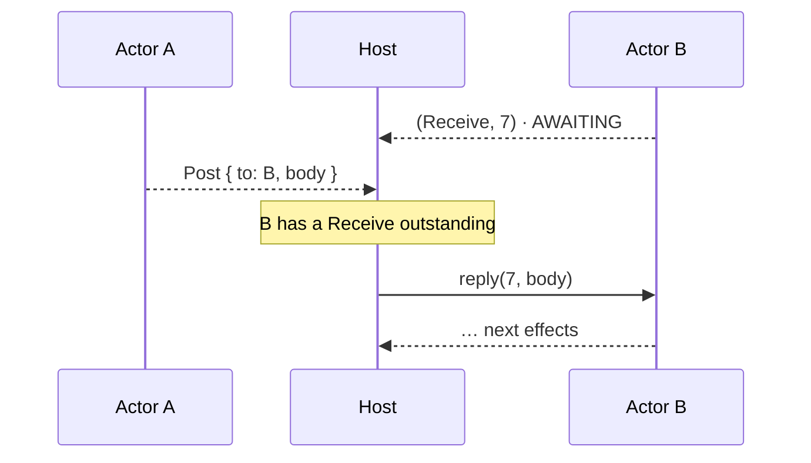
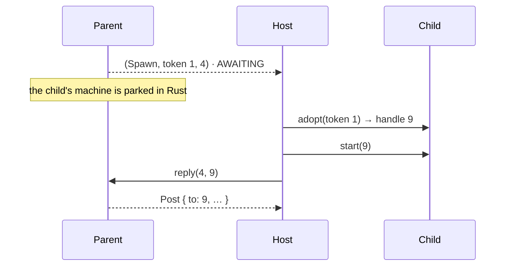

# Actors

> [!NOTE]
> _Status:_ planned. None of this exists yet.

Routines that message each other and spawn new routines, without a scheduler in the library.

## The host is the scheduler

Sending, receiving, and spawning are capabilities like any other. Natively, tokio serves them with channels and `tokio::spawn`. Behind a driver, the context records them and the _host_ routes them — the same way it already performs `Lookup`. Whoever polls is the scheduler: tokio, the JS event loop, a Python loop, or a deterministic test harness.



## Traits

| Trait                 | Signature                                                   | Kind → reply | tokio                                 | Behind a driver     |
|-----------------------|-------------------------------------------------------------|--------------|---------------------------------------|---------------------|
| `Post`                | `fn post<M: Message>(&self, to: Address<M>, msg: M)`        | tell         | send the value on the target's channel | `to · addrs · body` |
| `Receive<M: Message>` | `async fn receive(&self) -> M`                              | ask → bytes  | take the next value from the channel  | `id`                |
| `Spawn`               | `async fn spawn(&self, child) -> Address<M>`                | ask → `u64`  | `tokio::spawn`                        | `token · id`        |
| `Me`                  | `async fn me<M: Message>(&self) -> Address<M>`              | ask → `u64`  | a ready future                        | `id`                |

`Send` is taken by `core::marker::Send`, and `Tell` would read like `Outbox::tell`, which tells the _host_. Hence `Post`.

`Message` is one marker trait bundling what both interpreters need: `Send + 'static` for tokio, `Encode + Decode` for the wire.

`Me` is a request rather than a construction argument. The host table allocates a handle only after the routine's future is built, so a construction-time address would mean threading the handle through the table for one capability. A routine that needs its own address asks once, at the top.

## Addresses

`Address<M>` names an actor _and_ the type of message its mailbox accepts, like Akka Typed's `ActorRef<T>`. Posting the wrong type does not compile.

- _Behind a driver_, an address is the host's machine handle: `u64`, never `0`, never reused. No second id space, no translation.
- _Under tokio_, the registry mints its own from `1`.
- It has a private constructor. Safe code obtains one only by introduction. See [`capabilities`](capabilities.md).

## Messages

- _Under tokio_, a message is a value in a channel. Nothing is encoded.
- _Behind a driver_, a message is bytes, because the host routes it without looking inside. See [`effects`](effects.md#all-actor-messages-are-bytes-on-the-wire).
- _One message type per actor_ (`enum Msg`), as in Erlang. On the wire, a body that fails to decode is dropped by the context, which receives again. The routine never sees garbage.

## Spawn

### By value

The parent builds its child in Rust and hands the host a token:

```rust
let child: Address<Greeting> =
    ctx.spawn(|outbox| Greeter::new(Ctx::new(outbox), name, me).run()).await;
```



The host never sees the child's code or arguments. It calls one generic `<prefix>_adopt(token) → handle`, the same for every kind of child. The arguments stay typed Rust values — including any addresses among them, which therefore need no special handling.

This is Mark Miller's "only connectivity begets connectivity": an object gets a reference only by initial conditions, parenthood, endowment, or introduction. Spawning by value is parenthood (the parent gets the child's address) plus endowment (the child gets what the parent passes it). Given `Spawn`, it needs no further authority. In E, too, creating an object grants nothing beyond what the creator passes in.

> [!IMPORTANT]
> A child built by value gets its parent's vocabulary `E`, or a narrower one. Otherwise a parent limited to `Quiet` could spawn a child with `Full` and escape its own limits.

### Does the token being local hurt?

A parked token means something only in its own process. For spawning, that loses almost nothing: a running routine is a pinned Rust future, a compiler-generated state machine that cannot be serialized or moved. However a child is created, once it runs it stays in its process.

Creating a child in _another_ process cannot be done by value in any design, because code cannot travel — only a name and data can. Erlang shows this: `spawn(Node, Fun)` sends the fun as module + index + captured variables, and fails if the other node has a different version of that module. The reliable form names the code: `spawn(Node, M, F, Args)`.

What locality does cost:

| | By value (token) | By name (bytes) |
|---|---|---|
| Typing | typed end to end | `Decode` on the far side |
| Host loop | one `adopt` call | a map from names to constructors |
| Host can read, log, or refuse the arguments | no — it can count and refuse adoptions | yes |
| Replay the whole system | yes: re-running the parent parks the same child again | yes |
| Replay or restore one actor alone | no: its arguments live in its parent's memory | yes |
| Create the child in another process | no | yes |
| Leak if never adopted | yes, so parked tokens need a free path, like `buf_free` | no |

### Portable spawn: factories

Object-capability systems do not make remote creation a primitive. A vat exports a _factory_; you send it arguments as a message, and it replies with a reference to what it made. The same works here with nothing new: a factory is an actor whose messages are creation requests. Its message is bytes, so it can be logged, persisted, or sent to another process. Holding a factory's address _is_ the authority to create that kind of actor — there is no ambient "spawn anything by name".

So the ABI needs only nullary named constructors for root actors (factories among them) and one generic `adopt`.

## Timeouts

An actor waiting in `receive` also needs to time out, heartbeat, or stop. That is `select` — "whichever comes first" — next to `join`:

```rust
match select(ctx.receive::<Msg>(), ctx.sleep(TIMEOUT)).await {
    Either::Left(msg) => handle(msg),
    Either::Right(()) => give_up(),
}
```

The losing branch is abandoned mid-flight. What that means for the host is in [`cancellation`](cancellation.md).

## Deadlock

If every machine is `AWAITING`, every outstanding request is a `Receive`, and no message is queued, nothing can ever run again. The host sees all of this, so detecting it is one check in its loop. This is not part of the ABI: `STALLED` keeps its meaning (one machine waiting on something nothing can wake).

## Demos

- _Ping-pong_ — two actors, one message each way, repeated. The teaching example.
- _Ring_ — N actors in a ring pass a token M times around. Measures the cost of one hop on each host.
- _Front desk_ — a receptionist reads names and spawns a greeter for each; each greeter looks up a greeting and posts it back. Its transcript joins the tokio = Node = Python = Java comparison.

## Open questions

- What does the tokio `Registry` store? By-value spawn under tokio is just `tokio::spawn`; factories need a type-erased map from names to constructors.
- Supervision: the host already sees `COMPLETE` and `PANICKED`. Telling a linked actor is a host-loop feature, not a library one — but which host loops should show it?
