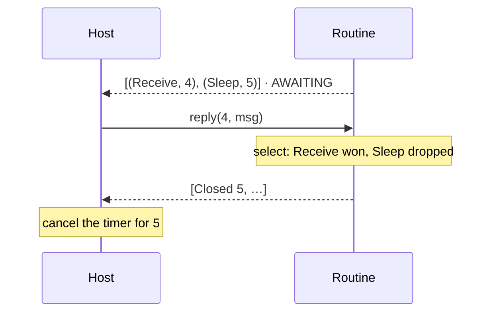

# Cancellation

> [!NOTE]
> _Status:_ planned. Abandoning a request works today inside Rust; telling a foreign host does not exist yet.

## `select`

`join(a, b)` waits for both. Actors keep needing "whichever comes first": a receive with a timeout, a heartbeat, "stop or keep working". `no_std` has no `select!`, so `sans-effort` gets a small combinator next to `join`:

```rust
match select(ctx.receive::<Msg>(), ctx.sleep(TIMEOUT)).await {
    Either::Left(msg) => handle(msg),
    Either::Right(()) => give_up(),
}
```

Under tokio that is the whole story: dropping the losing future cancels it.

## What happens behind a driver

Both branches record their effects before either completes, so the host sees `[(Receive, 4), (Sleep, 5)]`. When the message arrives, the `Sleep` future is dropped. The mechanism has handled this from the start:

- dropping a polled request closes its slot;
- `Driver::closed()` reports the id;
- the host layer's `Machine` forgets its reply handle;
- a late reply to that id is `BAD_INPUT`.

`select` is the first routine shape that exercises this. `join` never drops anything, so until now the path was covered only by a unit test.

## The gap

Nothing tells a _foreign_ host. `Machine` uses `closed()` only to tidy its own table. Python never learns that id 5 was abandoned, so it keeps its thirty-second timer, replies when it fires, and gets `BAD_INPUT`. That is harmless for a timer and wasteful for anything that costs something — a network request the host should cancel, a file it is still reading.



## Proposal: a closed record

Report abandoned ids in the effects stream, so each call returns what the routine recorded _and_ what it gave up on.

| Option                                | Shape                                         | For                                               | Against                                                     |
|---------------------------------------|-----------------------------------------------|---------------------------------------------------|-------------------------------------------------------------|
| Reserved tag `0` in the effects stream | `00 · id`                                     | One stream; hosts already loop over records; tag `0` is unused | Takes one tag from every routine's vocabulary             |
| A trailer after the effects           | `effects · count · ids`                       | Vocabularies keep all 256 tags                    | A second format in every host's parser                      |
| A separate call                       | `<prefix>_closed(handle, out) → i32`          | Nothing changes in the stream                     | One more call per step; easy to forget                      |

The lean is the reserved tag: hosts already dispatch on tags, and reserving `0` costs vocabularies almost nothing.

Precedent: Cap'n Proto's RPC protocol has a `Finish` message — "the caller no longer needs this answer" — that lets the callee cancel. Here the routine is the caller and the host the callee, so a closed record is exactly `Finish`: the routine telling the host it no longer needs the answer.

## ABI revision

A host written without closed records would misparse one, so by `ABI.md`'s rule this changes the revision. It is still `0`, pre-release, so the text changes and the number does not. After publication, the same change would bump it.

## Tests

- `select` resolves to whichever branch finishes first, in both orders.
- The losing branch's id appears in `Driver::closed()` exactly once.
- The byte layer emits a closed record for it, after any effects from the same step.
- A late reply to a closed id is `BAD_INPUT` and changes nothing.
- A request polled and dropped in the same step appears as a closed record and is never answered.
