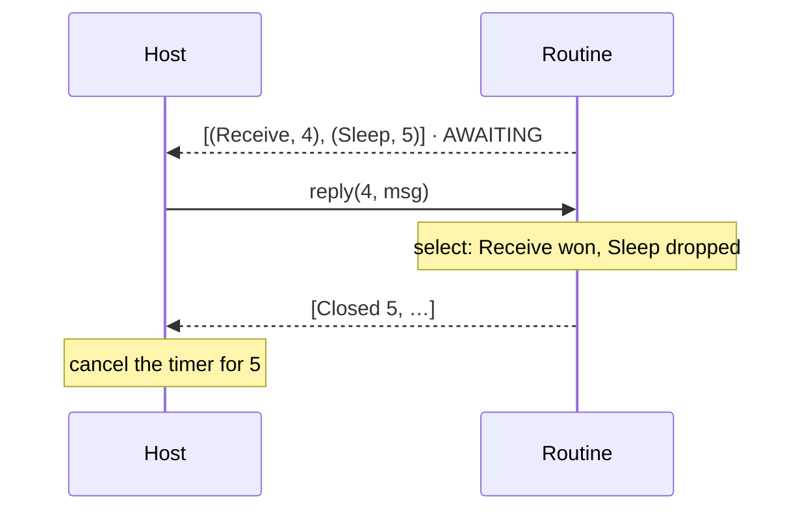

# Cancellation

> [!NOTE]
> _Status:_ implemented: `select`, closed frames, `Yield`, and the `MALFORMED`/`STALE` codes. The demo's `deadline` routine races a receive against a sleep and produces closed frames end to end: Python drops the abandoned timer, Java cancels the thread sleeping it, Node's dispatcher aborts the host's timer through an `AbortSignal`, and tokio drops it — checked in CI by a time limit.

## `select`

`join(a, b)` waits for both. Routines that message each other keep needing "whichever comes first": a receive with a timeout, a heartbeat, "stop or keep working". `no_std` has no `select!`, so `sans-effort` gets a small combinator next to `join`:

```rust
match select(ctx.receive::<Msg>(), ctx.sleep(TIMEOUT)).await {
    Either::Left(msg) => handle(msg),
    Either::Right(()) => give_up(),
}
```

Under tokio that is the whole story: dropping the losing future cancels it.

## What Happens Behind a Driver

Both branches record their effects before either completes, so the host sees `[(Receive, 4), (Sleep, 5)]`. When the message arrives, the `Sleep` future is dropped. The mechanism has handled this from the start:

- dropping a polled request closes its slot;
- the id is reported in the yield's `closed`;
- the host layer's `Machine` forgets its reply handle;
- a late reply to that id is `BAD_INPUT`.

`select` is the first routine shape that exercises this. `join` never drops anything, so until now the path was covered only by a unit test.

## The Gap This Closed

Before closed frames, nothing told a _foreign_ host. `Machine` used the closed ids only to tidy its own table. Python never learned that id 5 was abandoned, so it kept its thirty-second timer, replied when it fired, and got `BAD_INPUT`. That was harmless for a timer and wasteful for anything that costs something — a network request the host should cancel, a file it is still reading.


```mermaid
sequenceDiagram
    participant H as Host
    participant R as Routine

    R-->>H: [(Receive, 4), (Sleep, 5)] · AWAITING
    H->>R: reply(4, msg)
    Note over R: select: Receive won, Sleep dropped
    R-->>H: [Closed 5, …]
    Note over H: cancel the timer for 5
```

## Closed Frames

Abandoned ids are reported in the effects stream, so each call returns what the routine recorded _and_ what it gave up on. Every effect already crosses as a frame — `u8 kind · u32 len · payload` — so a closed record is one more frame kind:

```text
  kind 3 · len 8 · u64 id        "the routine no longer needs a reply to id"
```

It belongs to the ABI, not to any routine's vocabulary, so no tag is taken from anyone. A host written before closed frames existed skips them, as it skips every frame kind it does not know; it simply never cancels early.

The design considered a reserved tag `0` inside the effect records, a trailer after them, or a separate `<prefix>_closed` call. Frames make all three unnecessary.

Precedent: Cap'n Proto's RPC protocol has a `Finish` message — "the caller no longer needs this answer" — that lets the callee cancel. Here the routine is the caller and the host the callee, so a closed frame is exactly `Finish`: the routine telling the host it no longer needs the answer.

## Limits

### A Closed Frame Means "no longer needed", Not "undone"

If `select(pay(), sleep(TIMEOUT))` times out, the payment may still go through. Cancellation tells the host it may stop; it cannot unperform an effect that has started. Tokio has the same property. A routine that races an effect with consequences must treat the losing branch as _possibly done_. Each effect says which kind it is — see [Cancel Safety](#cancel-safety).

### Late Replies Stay Harmless

A host can still reply to an abandoned id: a timer thread can fire while the call that returns `Closed 5` is in flight. That reply is refused with a code and changes nothing — no bytes are written, the routine is not polled, and the machine stays in the table. Only a panic removes a machine.

Closed frames don't make late replies impossible; they make them _distinguishable_. A host that has been told "5 closed" knows a refused reply to 5 is expected, and a refused reply to any other id is a bug worth logging.

### Completion, Panics, and `free` Close Everything

A routine that completes, panics, or is freed with requests still outstanding has abandoned all of them. The final batch on `COMPLETE` carries a closed frame for each; `PANICKED` and `free` close every outstanding id without one, and `ABI.md` says so. Otherwise hosts leak work at exactly the moments that matter most.

### Only Asks Can Be Cancelled

A tell has no id and no reply, so there is nothing to close.

## Cancel Safety

`select` is correct whatever it races: the loser is dropped, its asks close, a late reply is refused. What the race can _lose_ depends on the loser, and only on the loser — so cancel safety is each effect's to state, not the mechanism's. Every effect trait has a "Cancellation" section naming one of three kinds:

| Kind | Effects | If its request closes after the host performed it |
|---|---|---|
| _Retractable_ | `Sleep`, `Now`, `Var`, `ReadFile` | The result is discarded; nothing is lost. A host should stop the work (a timer). |
| _Consuming_ | `ReadLine`; `Random` | The value is used up. For `Random` nothing a routine needed is lost — the next draw is as good. For `ReadLine` a line is: it is the one effect here that is _not cancel-safe_. |
| _Committing_ | `WriteFile` | It happened, or may have; the routine will not learn which. |

A host that already holds a result for a closed id discards it, and releases anything it stands for; `ABI.md` asks nothing more.

### Racing a Read Without Losing It

The pattern is tokio's: race a pinned future _by reference_. The loser dropped is then the reference, not the read, which goes on and is awaited later — no request is ever closed, so no host can lose its line:

```rust
let mut read = pin!(ctx.read_line());
loop {
    match select(read.as_mut(), ctx.sleep(Duration::from_secs(5))).await {
        Either::Left(line) => return line,
        Either::Right(()) => ctx.write_line("Still waiting…".into()),
    }
}
```

It needs no help from hosts, contexts, or the library. Its limits are visible in the routine's own code: a read still pending when the routine ends is abandoned all the same; and natively a pending read holds `TokioInput`'s lock, so another reader of a shared input waits for it.

Natively, `TokioInput` is cancel-safe on its own: it reads with `read_until` into a buffer it keeps, so a read dropped mid-line leaves its bytes for the next read. tokio's own `read_line` throws them away — a timeout that fired while a user was typing would garble the next line.

### What Was Tried, and Why Not

A scratch experiment compared ways to make an abandoned read lose nothing, against a worst-case host: one that takes a line the moment it sees the ask, replies after a random delay, and cannot stop a read once started (as a host blocked on `System.in` cannot).

- _Host push-back_ — a held line for a closed id goes back to the input. Alone, it is a trap: with purely sequential reads it still produced gaps and reorders, because the line returns only when the host's read finishes, by which time later reads have taken later lines. It needs a second rule — one read in flight per input, served in the order asked, a read that closes while waiting giving up its place — and with both it loses nothing, even when a routine ends with a read pending. It is the only design that does, and the only one that asks every host author for something subtle; it remains the path if zero loss is ever needed.
- _A context that keeps the read alive_ — an adapter whose abandoned read is parked for the next `read_line`. No gaps, but the parked read is per context (a parent's late line arrives after a child's), and natively it parks `TokioInput`'s lock with nobody polling it, so another reader of the same input waits until the parent reads again — a deadlock if the parent waits on that reader.
- _A reader machine and a channel_ — the routine races the channel instead. No gaps, but it reads ahead, and what it read ahead is lost when the consumer stops: about a line in nearly every run.

Racing by reference beats all three on what it asks for — nothing — and shares their one remaining leak.

## Decisions Along the Way

- _Closed ids travel with their yield._ `Driver::resume` and `reply` return a `Yield`: the effects and the ids abandoned while producing them. It iterates over the effects, so a host with nothing to cancel uses it like the `Vec` it replaced; a host that cares reads `closed()`. The ids can no longer drift apart from the step that closed them.
- _Refused replies say why._ `BAD_INPUT` is now only an id never issued. `MALFORMED` is a reply record that does not parse. `STALE` is a reply to an id that was issued but is no longer awaited — answered, or closed — so even a host that ignores closed frames can tell a late reply from a bug. `STALE` needs no memory beyond the highest id shown to the host.

## ABI Revision

None. `ABI.md` reserves every frame kind beyond tell and ask for later records, and requires hosts to skip the ones they do not know, so adding closed frames breaks no host. Only the text changes: frame kind `3` gets a name.

## Tests

- `select` resolves to whichever branch finishes first, in both orders.
- The losing branch's id appears in `Driver::closed()` exactly once.
- The byte layer emits a closed frame for it, after any effects from the same step.
- A late reply to a closed id is refused and changes nothing: no bytes, no poll, the machine stays.
- A request polled and dropped in the same step appears as a closed frame and is never answered.
- A routine that completes with requests outstanding closes each of them in its final batch.
- A host that does not know frame kind `3` skips it and still completes.
