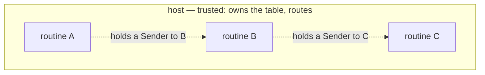

# Capabilities

> [!NOTE]
> _Status:_ planned, alongside [`channels`](channels.md). `ReplyHandle` and vocabulary attenuation exist today.

The claim this design makes:

> [!IMPORTANT]
> Given an honest host and safe-Rust routines, a routine's authority is exactly the set of channel ends it holds, and each one it holds it opened, or was given by something that held it.

In short: _object capabilities within a process, given an honest host._

## The parties



The host — tokio's registry, a Python loop, a test router — is the vat. It owns the tables and does the routing, so it is trusted by construction. Routines are not trusted: they may be written by other parties. The design constrains them, not the host.

## Where references come from

A routine can come to hold a channel end in exactly these ways, which are Mark Miller's rules for how connectivity arises:

| Route          | In this design                                  | Granted by        |
|----------------|-------------------------------------------------|-------------------|
| Creation       | `open()`: both ends of a new channel            | the host          |
| Endowment      | its construction arguments, given at spawn      | its parent        |
| Introduction   | a `Sender` inside a message it received         | the sender        |

Parenthood alone grants nothing: `spawn` returns no handle. A parent reaches its child only through a channel it opened and endowed the child with — which is what `spawn_with_inbox` packages.

`Post` and `Receive` are the network: having them grants nothing by themselves. Authority is the channel ends held.

Attenuation works two ways. _By trait:_ a routine whose context lacks `Lookup` cannot look anything up, and a routine that needs it does not compile under that context. _By reference:_ a routine can post only on the senders it holds, and receive only on the receivers it holds. Revocation is the classic forwarder: hand out a sender to a proxy routine instead, and stop forwarding when access should end.

`ReplyHandle<T>` is a capability in the full sense today: unforgeable, single-use, and bound to the driver that minted it.

## Handles cannot be forged in Rust

`Sender<M>` and `Receiver<M>` have private constructors and no public `Decode`. Safe code cannot fabricate one.

- _Under tokio_ this is the whole story. A message is a Rust value, and a value cannot contain a handle its sender did not hold.
- _On the wire_ it is not, because a message body is bytes that the sender encodes.

### The hole: bytes in a body

A malicious sender does not need a `Sender` value to write eight bytes where the receiver expects one:

```text
  A holds a Sender to B, not to C.
  A guesses C's channel id and encodes it in a body:   post(to_b, Msg { reply_to: <C?> })
  B decodes a Sender it believes A held, and posts to C on A's behalf.
```

A cannot post to C directly, but it can get B to do it — a confused deputy.

### The fix: handles out of band

Handles travel beside the body, not in it — as Unix passes file descriptors (`SCM_RIGHTS`) and Cap'n Proto carries a table of capabilities with each message:

```text
  Post record:   channel · handles: [channel id] · body: bytes
                                ▲                   │
                                └── body refers to handles by index
```

- The sender's context builds `handles` from real handle values — the only kind safe Rust can produce.
- The host forwards the list untouched, and may check each entry is a live channel.
- The receiver's decoder gets handles only from that list, through a reader only the context can construct. Body bytes never become a handle.

The table carries capability handles in general, not one kind. Today that is `Sender`s, which copy. A `Receiver` in a message would need _move_ semantics — the sender gives up its end — and is not supported yet; receivers move only by value, at spawn.

Now a sender can introduce only what it holds.

## What a malicious routine can and cannot do

Given an honest host and routines in safe Rust:

| A routine can…                                                   | Because                                                    |
|------------------------------------------------------------------|------------------------------------------------------------|
| Post anything of the right type on a sender it holds             | holding it is the authority                                |
| Pass a sender it holds to another routine                        | delegation is allowed                                      |
| Spawn children, with at most its own vocabulary                  | a child built by value gets its parent's vocabulary or less |
| Send a body that fails to decode                                 | the receiver's context drops it                            |
| Exhaust resources: flood messages, open many channels, spawn many children | the host can count, rate-limit, and refuse — policy, not capability |

| A routine cannot…                                                | Because                                                    |
|------------------------------------------------------------------|------------------------------------------------------------|
| Post on a channel it was never given a sender for                | `Sender` has no public constructor                         |
| Receive on a channel it does not hold the receiver for           | `Receiver` has no public constructor, and is unique        |
| Get another routine to post somewhere on its behalf by forging bytes | handles cross out of band, never in the body           |
| Use a capability its context lacks                               | the routine does not compile under that context            |
| Answer another routine's request                                 | `ReplyHandle` is unforgeable and bound to its driver       |

## Untrusted guests

A _c-list_ is a table that translates between references and small integers at a trust boundary: the holder sees only its own numbering, so guessing integers is useless. Agoric's SwingSet keeps one per vat. Should hosts keep one per routine?

Only if some routines can forge integers — and a c-list only helps some of those:

| Untrusted routine                                 | Does a c-list in the host help?                                                                    |
|---------------------------------------------------|----------------------------------------------------------------------------------------------------|
| Safe Rust routine                                 | Not needed: the private constructor and the out-of-band table cover it                             |
| `unsafe` Rust routine                             | No: it can read the host's memory, and no table survives that                                      |
| Host-language code, such as third-party Python    | No: the language cannot isolate it, so it can call the ABI with any handle or edit the host's tables |
| A sandboxed guest: a Wasm module, Hardened JS     | Yes — the one real case                                                                            |

For that case, the c-list belongs where the guest is embedded, not in the host scheduler or the ABI. A guest adapter — a Rust context that implements the effect traits for a guest module — holds real `Sender`s and `Receiver`s and shows the guest only indices into its own table. Everything outside the adapter is unchanged: other routines, host loops, the wire.

```text
  trusted Rust routines ── Sender<M> ──┐
                                        host scheduler (unchanged)
  Wasm guest ── indices ── [ adapter: c-list ↔ Sender<M> ] ──┘
```

Putting it in the host instead would make every host translate the channel and every `handles` entry on every post, grow tables that only shrink with "I dropped this sender" messages, make transcripts show a different number for the same channel depending on who refers to it — and all of it would protect only the guests the adapter already protects.

A separate question, not this one: tables _between_ hosts, when routines span processes. See below.

## Across hosts

One host is one vat. Machine handles and channel ids are _near_ references: they mean something only in that host's process, and that is fine. If routines ever span processes, the problem is CapTP's, and its answers carry over. Its principle: never make a local token global; translate at every boundary.

| Problem                                                          | CapTP's answer                                                                                          |
|------------------------------------------------------------------|---------------------------------------------------------------------------------------------------------|
| A reference crosses to another vat                               | Per-connection import and export tables. The sender exports and sends an index; the receiver makes a proxy |
| A introduces B to an object in C                                  | Three-party handoff (E, OCapN, Cap'n Proto Level 3). Fallback: proxy through A                          |
| A reference must be written down: persisted, logged, mailed      | A _SturdyRef_: vat identity + location + a _swiss number_, a large random secret. Unforgeable because unguessable |
| An exported reference is never used                              | Distributed garbage collection: the importer releases it                                               |
| The caller no longer wants an answer                             | Cap'n Proto's `Finish` — see [`cancellation`](cancellation.md)                                          |
| Create an object in another vat                                  | Not a primitive: send arguments to a factory the other vat exports                                     |

Routines never see any of this. They hold `Sender<M>` and `Receiver<M>`, and their representation is the host's business — which is what makes such a layer possible without changing a routine.

### Why not swiss numbers on the wire now?

Unguessable channel ids would make forging a body useless without the out-of-band table. But a swiss number is a bearer token: anyone who reads it holds the capability. A transcript full of them is a bag of live capabilities, and transcripts are meant to be shared, compared, and replayed. The out-of-band table keeps transcripts harmless.

## Open questions

- Should the host verify each entry in `handles` is live, or is forwarding enough?
