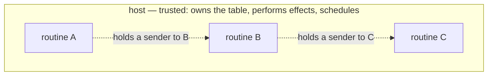

# Capabilities

> [!NOTE]
> _Status:_ `ReplyHandle` and vocabulary attenuation exist today. Spawning and channels between machines are planned; see [`channels`](channels.md).

The claim this design makes:

> [!IMPORTANT]
> Given an honest host and safe-Rust routines, a routine can perform only the effects its context grants, and can reach another routine only through a channel end it created or was given.

In short: _object capabilities within a process, given an honest host._

## The Parties



The host — a Python loop, a Java loop, tokio, a test harness — is the vat. It owns the table of machines, performs every effect, and decides when each machine runs, so it is trusted by construction. Routines are not trusted: they may be written by other parties. The design constrains them, not the host.

## Two Kinds of Authority

| Authority | Held as | Granted by | Attenuated by |
|-----------|---------|------------|---------------|
| Asking the world for something: time, input, a lookup | the context, through the effect traits it implements | the host, by the vocabulary it offers | trait: a routine whose context lacks `Lookup` does not compile |
| Reaching another routine | a channel end | whoever created the channel | reference: a routine can send only on the senders it holds |

The context is the capability; an effect trait is the interface to part of its authority, not a capability itself. That is the split drawn by "effects as capabilities" (Effekt): the effect is the interface, the capability is the value that grants it.

`ReplyHandle<T>` is a capability in the full sense today: unforgeable, single-use, and bound to the driver that minted it.

## Where Channel Ends Come From

A routine can come to hold a channel end in exactly these ways — Mark Miller's rules for how connectivity arises:

| Route        | In this design                                              |
|--------------|-------------------------------------------------------------|
| Creation     | it created the channel                                      |
| Endowment    | its parent moved the end into the closure it spawned it with |
| Introduction | the end arrived inside a message it received                |

Parenthood alone grants nothing: `spawn` returns no handle. A parent reaches its child only through a channel it created and endowed the child with. Revocation is the classic forwarder: hand out a sender to a proxy routine instead, and stop forwarding when access should end.

## Channel Ends Cannot Be Forged

A channel end is a Rust object reference: a pointer to shared memory, owned and moved by the compiler's rules. Safe code can obtain one only by creating a channel or by being given one, and a message is a Rust value, which cannot contain a reference its sender did not hold. Nothing is encoded, so there are no bytes to forge and no table of identifiers to guess into.

This is why the design needs no table of handles beside each message, as Unix passes file descriptors (`SCM_RIGHTS`) or Cap'n Proto carries its capability table: those exist because their messages are bytes. These messages never are.

## Spawning Cannot Escape the Parent's Limits

Under the reifying context, a child's context is `Ctx<E>` for the parent's own vocabulary `E`. A parent limited to `Quiet` cannot spawn a child with `Full`: the child's type says so. Spawning grants no capability the parent did not have.

## What a Malicious Routine Can and Cannot Do

Given an honest host and routines in safe Rust:

| A routine can…                                                   | Because                                                    |
|------------------------------------------------------------------|------------------------------------------------------------|
| Send anything of the right type on a sender it holds             | holding it is the authority                                |
| Pass a channel end it holds to another routine                   | delegation is allowed                                      |
| Spawn children, with at most its own vocabulary                  | the child's context has the parent's vocabulary            |
| Create channels                                                  | channels are plain Rust, not an effect                     |
| Exhaust memory with messages                                     | messages live in Rust memory the host does not see — see below |
| Spawn many children                                              | the host can count, rate-limit, and refuse spawns — policy, not capability |

| A routine cannot…                                                | Because                                                    |
|------------------------------------------------------------------|------------------------------------------------------------|
| Send on a channel it was never given a sender for                | a sender is an object reference, not a number              |
| Receive on a channel it does not hold a receiver for             | the same                                                   |
| Use an effect trait its context lacks                            | the routine does not compile under that context            |
| Answer another routine's request                                 | `ReplyHandle` is unforgeable and bound to its driver       |

### Messages Are Outside Host Policy

Messages never pass through the host, so the host cannot count, rate-limit, log, or refuse them. Its levers are the effects it performs and the machines it schedules: it can stop resuming a machine, or free it. Where messages themselves must be policed — logged, metered, or carried to another process — host-routed channels are the answer, and they can be added alongside plain ones.

## Untrusted Guests

A _c-list_ is a table that translates between references and small integers at a trust boundary: the holder sees only its own numbering, so guessing integers is useless. Agoric's SwingSet keeps one per vat. Should hosts keep one per routine?

Only if some routines can forge references — and a c-list only helps some of those:

| Untrusted routine                                 | Does a c-list in the host help?                                                                    |
|---------------------------------------------------|----------------------------------------------------------------------------------------------------|
| Safe Rust routine                                 | Not needed: its references are Rust references                                                     |
| `unsafe` Rust routine                             | No: it can read the host's memory, and no table survives that                                      |
| Host-language code, such as third-party Python    | No: the language cannot isolate it, so it can call the ABI with any handle or edit the host's tables |
| A sandboxed guest: a Wasm module, Hardened JS     | Yes — the one real case                                                                            |

A sandboxed guest has its own memory, so it cannot hold a Rust channel end at all. The c-list belongs where the guest is embedded: a guest adapter — a Rust context that implements the effect traits for a guest module — holds the real channel ends and shows the guest only indices into its own table. Everything outside the adapter is unchanged.

```text
  trusted Rust routines ── channel ends ──┐
                                           host (unchanged)
  Wasm guest ── indices ── [ adapter: c-list ↔ channel ends ] ──┘
```

## Across Hosts

One host is one vat. Machine handles are _near_ references: they mean something only in that host's process, and channel ends cannot leave it at all. If routines ever span processes, the problem is CapTP's, and its answers carry over. Its principle: never make a local token global; translate at every boundary.

| Problem                                                          | CapTP's answer                                                                                          |
|------------------------------------------------------------------|---------------------------------------------------------------------------------------------------------|
| A reference crosses to another vat                               | Per-connection import and export tables. The sender exports and sends an index; the receiver makes a proxy |
| A introduces B to an object in C                                  | Three-party handoff (E, OCapN, Cap'n Proto Level 3). Fallback: proxy through A                          |
| A reference must be written down: persisted, logged, mailed      | A _SturdyRef_: vat identity + location + a _swiss number_, a large random secret. Unforgeable because unguessable |
| An exported reference is never used                              | Distributed garbage collection: the importer releases it                                               |
| The caller no longer wants an answer                             | Cap'n Proto's `Finish` — see [`cancellation`](cancellation.md)                                          |
| Create an object in another vat                                  | Not a primitive: send arguments to a factory the other vat exports                                     |

Such a layer would carry messages as bytes, so it would need a table of references beside each message — the out-of-band design that plain channels do not. Swiss numbers would be the wrong shortcut there: a bearer token makes a transcript a bag of live capabilities, and transcripts are meant to be shared, compared, and replayed.
