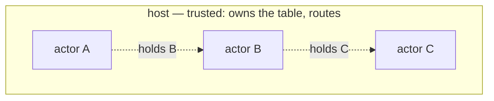

# Capabilities

> [!NOTE]
> _Status:_ planned, alongside [`actors`](actors.md). `ReplyHandle` and vocabulary attenuation exist today.

The claim this design makes:

> [!IMPORTANT]
> Given an honest host and safe-Rust actors, an actor's authority is exactly the set of addresses it was introduced to, and every introduction was made by something that held the address.

In short: _object capabilities within a process, given an honest host._

## The parties



The host — tokio's registry, a Python loop, a test router — is the vat. It owns the table and does the routing, so it is trusted by construction. Actors are not trusted: they may be written by other parties. The design constrains them, not the host.

## Where references come from

An actor can come to hold an address in exactly these ways, which are Mark Miller's rules for how connectivity arises:

| Route          | In this design                               | Granted by        |
|----------------|----------------------------------------------|-------------------|
| Initial        | `me()`: its own address                      | the host          |
| Parenthood     | `spawn`'s reply: the child it made           | the host          |
| Endowment      | its construction arguments                   | its parent        |
| Introduction   | an address inside a message it received      | the sender        |

`Post` is the network: having it grants nothing by itself. Authority is the addresses held.

Attenuation works two ways. _By trait:_ a routine whose context lacks `Lookup` cannot look anything up, and a routine that needs it does not compile under that context. _By reference:_ an actor can post only to the actors it holds. Revocation is the classic forwarder: introduce a proxy actor instead, and stop forwarding when access should end.

`ReplyHandle<T>` is a capability in the full sense today: unforgeable, single-use, and bound to the driver that minted it.

## Addresses cannot be forged in Rust

`Address<M>` has a private constructor and no public `Decode`. Safe code cannot fabricate one.

- _Under tokio_ this is the whole story. A message is a Rust value, and a value cannot contain an address its sender did not hold.
- _On the wire_ it is not, because a message body is bytes that the sender encodes.

### The hole: bytes in a body

A malicious sender does not need an `Address` value to write eight bytes where the receiver expects one:

```text
  A holds B, not C.
  A guesses C's handle and encodes it in a body:   post(B, Msg { reply_to: <C?> })
  B decodes an Address it believes A held, and posts to C on A's behalf.
```

A cannot post to C directly, but it can get B to do it — a confused deputy.

### The fix: addresses out of band

Addresses travel beside the body, not in it — as Unix passes file descriptors (`SCM_RIGHTS`) and Cap'n Proto carries a table of capabilities with each message:

```text
  Post record:   to · addrs: [Address] · body: bytes
                         ▲                  │
                         └── body refers to addresses by index
```

- The sender's context builds `addrs` from real `Address` values — the only kind safe Rust can produce.
- The host forwards the list untouched, and may check each entry is a live handle.
- The receiver's `Decode` gets addresses only from that list, through a reader only the context can construct. Body bytes never become an address.

Now a sender can introduce only what it holds.

## What a malicious actor can and cannot do

Given an honest host and actors in safe Rust:

| An actor can…                                                    | Because                                                    |
|------------------------------------------------------------------|------------------------------------------------------------|
| Post anything to an address it holds                             | holding it is the authority                                |
| Pass an address it holds to another actor                        | delegation is allowed                                      |
| Spawn children, with at most its own vocabulary                  | a child built by value gets its parent's vocabulary or less |
| Send a body that fails to decode                                 | the receiver's context drops it                            |
| Exhaust resources: flood messages, spawn many children          | the host can count, rate-limit, and refuse — policy, not capability |

| An actor cannot…                                                 | Because                                                    |
|------------------------------------------------------------------|------------------------------------------------------------|
| Post to an address it was never introduced to                    | `Address` has no public constructor                        |
| Get another actor to post somewhere on its behalf by forging bytes | addresses cross out of band, never in the body            |
| Use a capability its context lacks                               | the routine does not compile under that context            |
| Answer another routine's request                                 | `ReplyHandle` is unforgeable and bound to its driver       |

## Two kinds of c-list

A _c-list_ is a table that translates between references and small integers at a trust boundary. There are two places one could go, and they solve different problems.

- _Per actor, inside one host_ — as Agoric's SwingSet keeps one per vat. Each actor sees only its own numbering, so guessing integers is useless. This matters for actors that _can_ forge integers: untrusted Wasm modules, or actors written in the host language. Safe-Rust actors do not need it; the private constructor and the out-of-band table already cover them. Not planned.
- _Per connection, between hosts_ — the CapTP piece. Needed only when actors span processes. See below.

## Across hosts

One host is one vat. Machine handles and parked spawn tokens are _near_ references: they mean something only in that host's process, and that is fine. If actors ever span processes, the problem is CapTP's, and its answers carry over. Its principle: never make a local token global; translate at every boundary.

| Problem                                                          | CapTP's answer                                                                                          |
|------------------------------------------------------------------|---------------------------------------------------------------------------------------------------------|
| A reference crosses to another vat                               | Per-connection import and export tables. The sender exports and sends an index; the receiver makes a proxy |
| A introduces B to an object in C                                  | Three-party handoff (E, OCapN, Cap'n Proto Level 3). Fallback: proxy through A                          |
| A reference must be written down: persisted, logged, mailed      | A _SturdyRef_: vat identity + location + a _swiss number_, a large random secret. Unforgeable because unguessable |
| An exported reference is never used                              | Distributed garbage collection: the importer releases it                                               |
| The caller no longer wants an answer                             | Cap'n Proto's `Finish` — see [`cancellation`](cancellation.md)                                          |
| Create an object in another vat                                  | Not a primitive: send arguments to a factory the other vat exports                                     |

Routines never see any of this. They hold `Address<M>`, and its representation is the host's business — which is what makes such a layer possible without changing a routine.

### Why not swiss numbers on the wire now?

Unguessable addresses would make forging a body useless without the out-of-band table. But a swiss number is a bearer token: anyone who reads it holds the capability. A transcript full of them is a bag of live capabilities, and transcripts are meant to be shared, compared, and replayed. The out-of-band table keeps transcripts harmless.

## Open questions

- Per-actor c-lists inside a host, for untrusted actors: undecided — probably declined, at least deferred. A much heavier host loop for a threat that safe Rust already closes.
- Should the host verify each entry in `addrs` is live, or is forwarding enough?
