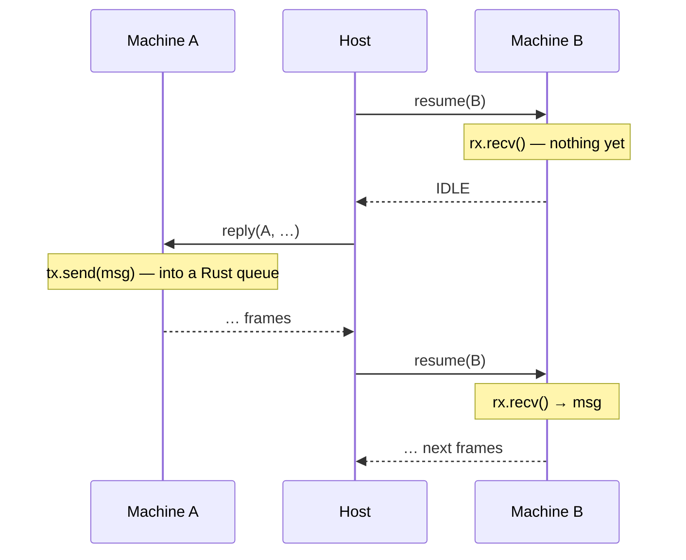

# Channels and Spawning

> [!NOTE]
> _Status:_ implemented, in two stages: `resume`, `IDLE`, `Spawn`, and pinned machines; then a real waker and `woke` frames. The demo's ping-pong, front desk, and ring run on tokio, Node, Python, and a parallel Java host. An actor layer on top — an implicit inbox per routine, supervision — may come later, and so may host-routed channels.

Routines that send each other messages and spawn new routines, on different threads, without a scheduler in the library.

## Channels Are Plain Rust

A channel is in-process synchronisation, not I/O. So routines use ordinary Rust channels — any primitive built on wakers works: `mpsc`, `oneshot`, `watch`, async mutexes, semaphores. They are not an effect trait and not an effect, and the library recommends no crate. The demo uses `async-channel`.

```rust
let (tx, rx) = async_channel::unbounded::<Ping>();
ctx.spawn_pinned(move |child_ctx| Pinger::new(child_ctx, rx).run());
tx.send(Ping).await.ok();
```

What the host must own is I/O — every effect — and _scheduling_: when, and on which thread, each machine is polled. Message passing is neither.

## The Host Schedules

Under a driver, a machine runs only when the host calls in for it. So a machine waiting on a channel, with no request outstanding, reports `IDLE`: suspended, waiting on something inside Rust. When a message arrives, the host has to poll it again. The ABI gives it a call for that, `resume`: poll without a reply.



The message never passes through the host. A spurious `resume` is harmless — the routine polls, finds nothing new, and suspends again — so correctness never depends on knowing _when_ to resume, only on resuming eventually.

### Knowing When: Wakers

Every poll in Rust is handed a waker, the executor's "call me when this can progress". A channel stores the receiver's waker when it has nothing to give, and calls it on the next send. Under tokio the waker requeues the task. Resuming every idle machine whenever there is nothing else to do would work too, slowly — but a host cannot tell a machine that progressed silently (it only sent a message) from a stalled one, so it cannot know when to stop.

The driver's waker records the wake instead. The host crate turns it into a frame, `woke · handle`, in the output of the call whose poll caused it — the sender's — or, for wakes outside any call, in the output of a separate `wakes` call. The host then resumes exactly the machines that can run. It is still pull-only: the host learns from output it asked for; nothing calls out to it.

| | Effect | Wake |
|---|---|---|
| Triggered by | the routine, explicitly: its context records a request | the channel's own code, calling the waker it stored |
| Means | "please do this for me" | "this machine can make progress now" |
| The host answers with | performing it; replying, if it is an ask | `resume` |

## Spawning

`Spawn` is an effect trait with two methods:

```rust
pub trait Spawn {
    type Child;   // the child's context

    fn spawn<F, Fut>(&self, f: F)
    where F: FnOnce(Self::Child) -> Fut + Send + 'static,
          Fut: Future<Output = ()> + Send + 'static;

    fn spawn_pinned<F, Fut>(&self, f: F)
    where F: FnOnce(Self::Child) -> Fut + Send + 'static,
          Fut: Future<Output = ()> + 'static;
}
```

- `spawn` starts a child that may move between threads after it starts. Its future must be `Send`. Every effect trait declares its futures `Send`, so a routine generic over its context can prove it: `C::Child: Send + Sync`. The price is that every context is `Sync`; one over a value tied to its thread — a `JsValue` — keeps it behind a dispatcher task and talks to it over a channel.
- `spawn_pinned` starts a child that stays on the thread that first resumes it. Only the closure must be `Send` — its future need not be — so the child may hold an `Rc` or a foreign handle across an `.await`.

Two methods, because even a multithreaded application sometimes holds data that is not `Send` — an `Rc`, a foreign handle. `spawn_pinned` gives those children a home while the rest move freely, in one build.

Both are fire-and-forget: they record the unstarted child and return. The closure's argument is the child's context, `child_ctx`, which does not exist until the child's machine does. Channel ends reach the child by moving into the closure.

### How a Child Reaches the Host

Behind a driver, the child rides in the effect: `Spawn` records a tell whose payload is the unstarted child. The vocabulary's `split` decides what spawning means. The demo registers it with the host table:

```rust
Full::Spawn(effect::Spawn(child)) =>
    (View::Spawned { handle: table::new_boxed(move |outbox| child.start(outbox)) }, None),
Full::SpawnPinned(effect::SpawnPinned(child)) =>
    (View::SpawnedPinned { handle: table::park_pinned(move |outbox| child.start(outbox)) }, None),
```

The host sees `Spawned { 9 }` or `SpawnedPinned { 9 }` and resumes machine 9 to begin it. None of the child crosses the FFI boundary — only its handle does. Core does not know which effect means "spawn", so a vocabulary may choose differently: its own statics, a test router's `Vec`, or no spawn variant at all, which grants no spawning.

> [!IMPORTANT]
> Under the reifying context, the child's context is `Ctx<E>` for the parent's own vocabulary `E`, so a parent limited to `Quiet` cannot spawn a child with `Full` and escape its own limits. The type enforces this.

### Pinned Children

A pinned child's future may hold values that must not leave their thread. So the table parks the unstarted child, and builds its future when the host first calls `resume` for it — on that thread — keeping it in that thread's table. Every later call for it must come from the same thread; a call from another returns `WRONG_THREAD`, which a host recovers from by routing the call where it belongs. Migrating machines keep the existing rule: any thread, one at a time.

Natively:

| Context | `spawn` | `spawn_pinned` |
|---------|---------|----------------|
| tokio | `tokio::spawn` — work-stealing | `tokio-util`'s `LocalPoolHandle` — a pool of threads; each child stays put |
| JS | `spawn_local` | `spawn_local` |

## Replay and Determinism

Messages bypass the host, so the order they arrive in depends on the host's schedule. A host prints a machine's writes after its call returns, so under a host that polls machines in parallel, writes from two machines interleave by timing: a transcript is comparable across hosts only when one machine writes it — which is why the demo's ping-pong child and ring nodes are silent. A run is reproduced by the host's replies _and_ its `resume`s, in order; the `woke` frames also record which step woke which machine. The demo's transcripts agree across all four hosts — the Java one polling machines in parallel on a pool of threads — because in each demo one machine writes.

## Knowing When a Routine Ends

A routine can hold a guard whose `Drop` sends on a channel a watcher holds. Messages are plain Rust, so this works however the routine ends — completion, a panic the host catches, or the host freeing it: the future is dropped, and the guard sends.

## Stalls, Spins, and the Outside World

- _A stall_ — no request outstanding anywhere, no `woke` frame left to act on, and nothing from `wakes`. The host can detect it: it sees every request and is told of every wake. (Without wakes it could not: a machine that only sends a message looks, from outside, exactly like one that did nothing.) This reads current state; it does not predict what code will do, so the halting problem does not apply. It is not part of the ABI.
- _A spin_ — a routine looping inside a step without awaiting. That breaks the assumption that steps return promptly; only a timeout helps.
- _The outside world_ — a routine waiting on input that never comes. No host can know whether it will. A timeout, as policy.

## Timeouts

A routine waiting on a channel often also needs to time out:

```rust
match select(rx.recv(), ctx.sleep(TIMEOUT)).await {
    Either::Left(msg) => handle(msg),
    Either::Right(()) => give_up(),
}
```

The losing branch is dropped. If it was the sleep, its request is reported closed; see [`cancellation`](cancellation.md). If it was the receive, nothing needs reporting: the message stays in the channel.

## What This Gives Up

Messages never pass through the host, so the host cannot see their contents: no logging, quotas, or policy on messages, and they cannot leave the process. Host-routed channels — the host keeping a queue per channel and routing every message — would restore that, at the cost of wire handles, a handle codec, and a queue per channel in every host. They can be added later alongside plain channels; a channel effect trait that routines ask their context for would let them switch without a rewrite.

## Demos

- _Ping-pong_ — a parent spawns a child (`spawn`) and plays three rounds over a channel each way; only the parent writes.
- _Front desk_ — a receptionist reads names and spawns a pinned clerk for each (`spawn_pinned`); each clerk looks a greeting up and sends it back on a one-shot channel.
- _Ring_ — 16 routines pass a counter 250 times around; no effect reports any of the 4000 hops, only `woke` frames. Each host prints its cost per hop.

All three join the greeter in the comparison: tokio = Node = Python = Java, byte for byte.
