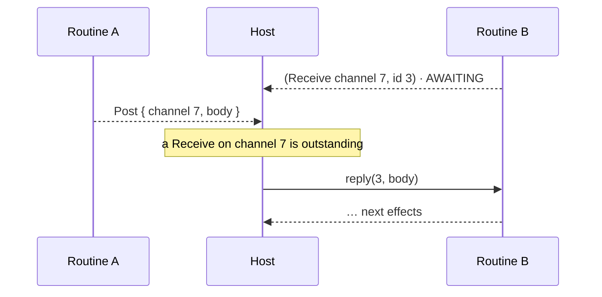
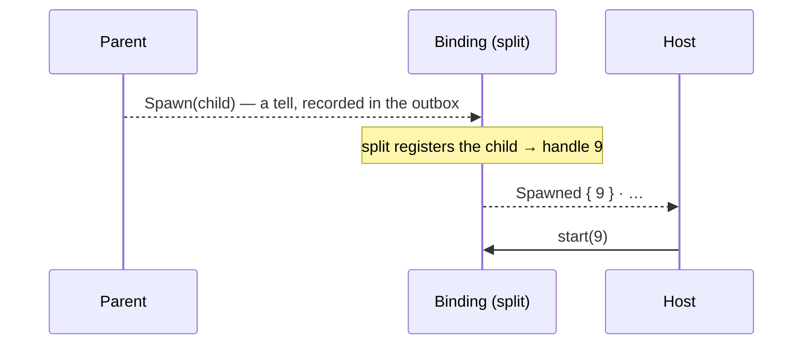

# Channels

> [!NOTE]
> _Status:_ planned. None of this exists yet. An actor layer on top of it — an implicit inbox per routine, spawn returning its address, supervision — may come later.

Routines that send each other messages and spawn new routines, without a scheduler in the library.

## Channels, not actors

The first design was actor-style: an address named a _routine_, and each routine had one implicit mailbox. This one is channel-style, as in Go, CSP, or Rust's own `mpsc`: a capability opens a channel, and its two ends are ordinary values that can be passed around.

```rust
let (tx, rx) = ctx.open::<Ping>().await;       // a new channel, both ends
ctx.spawn(|child| pinger(child, rx)).await;     // the child gets the receiving end
ctx.post(&tx, Ping);                            // we keep the sending end, or pass it on
```

Channels are the more primitive building block. Actors can be built from them — an actor is a routine with one designated channel, its address is a `Sender` to it, and spawning returns one — while channels built from actors would be a relay actor per channel. So channels come first, and an actor layer stays possible later with nothing to undo.

What channels remove, compared with actors:

- _No `Me`._ A routine that wants to be reachable opens a channel and hands out the sender.
- _No one-message-type-per-routine rule._ A routine can hold several receivers, each typed by its own message.
- _No address in spawn's reply._ The parent passes the child whatever channel ends it needs.

What they cost:

- _A second id space._ With actors, an address could be the host's machine handle. With channels, the host mints channel ids and keeps a queue per channel.
- _Channel lifetimes._ A queue must be freed when its receiver is gone — see [Closing](#closing).
- _No routine identity._ "Tell me when B ends" has no built-in subject — see [Knowing when a routine ends](#knowing-when-a-routine-ends).

## The host is the scheduler

Opening, posting, receiving, and spawning are capabilities like any other. Natively, tokio serves them with its own channels and `tokio::spawn`. Behind a driver, the context records them and the _host_ routes them — the same way it already performs `Lookup`. Whoever polls is the scheduler: tokio, the JS event loop, a Python loop, or a deterministic test harness.



Because `Receive` names its channel, the host never needs to know who owns a receiver. It keeps a queue per channel id and answers whichever `Receive` names it. Rust makes a `Receiver` unique, so only one holder can ask.

## Handles

`channel::Sender<M>` and `channel::Receiver<M>` — the names every Rust reader already knows from `mpsc`, reached through their module.

- Both are typed by the message: posting the wrong type does not compile.
- A `Sender` is `Clone`; a `Receiver` is unique.
- Both hold a channel id and have private constructors: safe code obtains one only by opening a channel or being given one. See [`capabilities`](capabilities.md).
- A `Receiver` also carries a small drop hook, so dropping it can tell its context — see [Closing](#closing). That keeps both handle types the same in every context.

## Capabilities

Provisional names; each is generic over the message type, so a context can bound `M` as it needs and a routine names exactly what it sends and receives (`C: Post<Ping> + Receive<Pong>`):

| Trait        | Does                                   | Natively (tokio)                    | Behind a driver                  |
|--------------|----------------------------------------|-------------------------------------|----------------------------------|
| `Open<M>`    | open a channel; returns both ends      | a new unbounded tokio channel       | ask → the host mints an id       |
| `Post<M>`    | send on a `Sender`; fire and forget    | send the value                      | tell: `channel · handles · body` |
| `Receive<M>` | await the next message on a `Receiver` | await the tokio receiver            | ask → the body, as bytes         |
| `Spawn`      | start a child routine                  | `tokio::spawn`                      | tell, carrying the child — see [Spawn](#spawn) |

Generic per trait rather than per method, because a trait method's bounds are fixed in the trait: `Ctx<E>` implements `Post<M>` only for messages it can encode, and the tokio context for any `M: Send + 'static`. A routine that only ever runs on tokio never has to make its messages encodable.

`Send` is taken by `core::marker::Send`, and `Tell` would read like `Outbox::tell`, which tells the _host_. Hence `Post`.

## Messages

- _Natively_, a message is a value in a channel. Nothing is encoded.
- _Behind a driver_, a message is bytes, because the host routes it without looking inside. See [`effects`](effects.md#all-channel-messages-are-bytes-on-the-wire). A body that fails to decode is dropped by the context, which receives again; the routine never sees garbage.
- Handles inside a message — a `Sender` for the reply, say — travel _beside_ the body, not in it, so a sender cannot forge one by writing bytes. See [`capabilities`](capabilities.md). The wire codec for this lives in `sans-effort-effects`, over core's `Writer` and `Reader`, and is designed for capability handles in general.

Request and response between routines is the familiar pattern: put a `Sender` for the reply in the request.

## Closing

When a `Receiver` is dropped, its queue should go: nothing can receive from it again. Short-lived channels are common — a reply channel per request — so without this the host would keep every such queue for as long as the routine that dropped it lives.

So dropping a `Receiver` is reported. Not as a new ABI frame kind, but as an ordinary stdlib effect, a tell (`Close { channel }`) that the receiver's drop hook records through its context. Under tokio the hook removes the queue from the registry instead. A `Post` to a closed channel is dropped, as a letter to a closed box would be; senders dropping need no report.

## Spawn

`Spawn` is the primitive: start a child, return nothing. Often there is no channel between parent and child at all. When there is, the parent opens it and passes the child the end it needs.

For the common case, a helper does both — the actor-style convenience, built from two primitives:

```rust
let inbox: channel::Sender<Job> =
    spawn_with_inbox(&ctx, |child, jobs: channel::Receiver<Job>| worker(child, jobs)).await;
```

It is a free function in `sans-effort-effects`, usable by any context with both `Open<Job>` and `Spawn`, so it adds nothing a context has to implement. It is also the seed of an actor layer, if one comes.

A child is built by value: the parent's context builds the child's routine in Rust. Its arguments stay typed values — any channel ends among them move with it, so a `Receiver` can pass to a child at spawn. Moving a `Receiver` inside _message bytes_ is not supported yet: it would need move semantics in the handle table.

### How a child reaches the host

Behind a driver, the child rides up in the effect. `Spawn` records a tell whose payload _is_ the child — boxed and not yet started, in the shape the host table already takes (`FnOnce(Outbox<E>) -> impl Future`). The vocabulary's `split` arm decides what spawning means. Registering the child in `sans-effort-host`'s table is one choice:

```rust
Full::Spawn(child) => (View::Spawned(table::new(child)), None),
```



The host sees "child 9 exists" in a frame and starts it. No reply goes to the parent, since `spawn` returns nothing; no token; no ABI function. The table releases its lock before a routine steps, so registering from inside `split` is safe.

Nothing in core changes: core carries effect values and does not know which one means "spawn". So a vocabulary can choose differently — a binding without `std` registers the child in statics of its own, a deterministic test router keeps children in a `Vec`, and a vocabulary without a `Spawn` variant simply grants no spawning. The one constraint is the chosen table's: `sans-effort-host`'s requires `Send` futures, so a child registered there must be `Send`.

The cost is coupling: a vocabulary whose `split` calls `sans-effort-host`'s table needs that crate's `std` feature, so a vocabulary crate that must also build `no_std` gates its `Spawn` arm behind a feature. `#[derive(Boundary)]` can generate the arm later.

> [!IMPORTANT]
> The child's type is `Child<E>` for the parent's own vocabulary `E`, so a parent limited to `Quiet` cannot spawn a child with `Full` and escape its own limits. The type enforces this; no check is needed.

A locality note, from when spawn was designed actor-style: a running routine is a pinned Rust future and can never leave its process, so building children by value loses nothing a routine had. Creating a child in _another_ process could never be by value — code cannot travel, only a name and data can (Erlang's reliable remote form is `spawn(Node, M, F, Args)`). That is what a factory is for: a routine whose messages are creation requests, reached through an ordinary `Sender`.

## Knowing when a routine ends

Channels do not name routines, so "tell me when B ends" is built from them: B holds a guard whose `Drop` posts a notice on a channel the watcher holds.

```rust
struct ExitNotice(channel::Sender<Exit>);
impl Drop for ExitNotice { fn drop(&mut self) { /* post Exit; a tell, so fine in Drop */ } }
```

What that does and does not catch:

| B…                         | Natively | Behind a driver                                              |
|----------------------------|----------|--------------------------------------------------------------|
| completes                  | notified | notified                                                     |
| panics                     | notified | lost: the machine is removed, and its last effects are never drained |
| is freed by the host       | notified | lost, the same way                                           |
| waits forever              | never    | never                                                        |

A host sees `PANICKED` and its own `free`, so it could post the notice on the routine's behalf — a supervision feature for later.

## Stalls, spins, and the outside world

`Drop` detects _endings_. Other ways of not finishing:

- _A system-wide stall_ — every routine waiting on a `Receive` whose queue is empty, and no timer, input, or other external request outstanding. The host can detect this: every wait goes through it, so it sees every outstanding request and every queued message. This is reading current state, not predicting what code will do, so the halting problem does not apply. Detecting it is one check in the host's loop; it is not part of the ABI, and `STALLED` keeps its meaning (one machine waiting on something nothing can wake).
- _A spin_ — a routine looping inside a step without ever awaiting. That breaks the assumption that steps return promptly, and nothing can decide it in general. Only a timeout helps.
- _The outside world_ — a routine waiting on input that never comes. No host can know whether it will. A timeout, as policy.

## Timeouts

A routine waiting in `receive` often also needs to time out, heartbeat, or stop. That is `select`, next to `join`:

```rust
match select(ctx.receive(&mut rx), ctx.sleep(TIMEOUT)).await {
    Either::Left(msg) => handle(msg),
    Either::Right(()) => give_up(),
}
```

The losing branch is abandoned mid-flight; its `Receive` is reported closed, so the host knows not to deliver the next message to it. See [`cancellation`](cancellation.md).

## Demos

- _Ping-pong_ — two routines, one message each way, repeated. The teaching example.
- _Ring_ — N routines in a ring pass a token M times around. Measures the cost of one hop on each host.
- _Front desk_ — a receptionist reads names and spawns a greeter for each with `spawn_with_inbox`; each greeter looks up a greeting and posts it back on a reply channel. Its transcript joins the tokio = Node = Python = Java comparison.

## Open questions

- Opening a channel as an ask (the host mints the id) or locally (the context mints an id the host qualifies). An ask is simpler and uniform; local minting would make opening synchronous.
- The exact shape of `Spawn`: what the child's context is (the parent's, or one built from its parts), and how that is expressed in the trait.
- Moving a `Receiver` inside message bytes: move semantics in the handle table.
