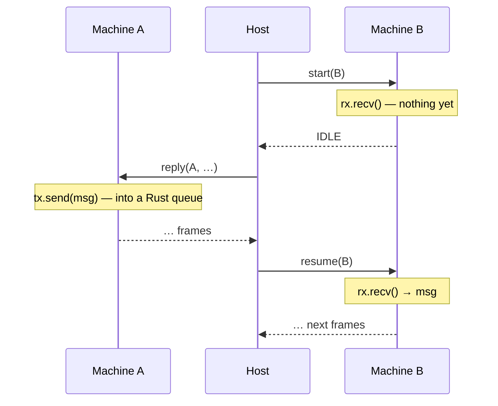

# Channels and Spawning

> [!NOTE]
> _Status:_ planned, in two stages. Stage 1: `resume`, `IDLE`, `Spawn`, and pinned machines. Stage 2: a real waker and `woke` frames. An actor layer on top — an implicit inbox per routine, supervision — may come later, and so may host-routed channels.

Routines that send each other messages and spawn new routines, on different threads, without a scheduler in the library.

## Channels Are Plain Rust

A channel is in-process synchronisation, not I/O. So routines use ordinary Rust channels — any primitive built on wakers works: `mpsc`, `oneshot`, `watch`, async mutexes, semaphores. They are not a capability and not an effect, and the library recommends no crate. The demo uses `async-channel`.

```rust
let (tx, rx) = async_channel::unbounded::<Ping>();
ctx.spawn_pinned(move |child_ctx| Pinger::new(child_ctx, rx).run());
tx.send(Ping).await.ok();
```

What the host must own is I/O — every effect — and _scheduling_: when, and on which thread, each machine is polled. Message passing is neither.

## The Host Schedules

Under a driver, a machine runs only when the host calls in for it. So a machine waiting on a channel, with no request outstanding, reports `IDLE`: suspended, waiting on something inside Rust. When a message arrives, the host has to poll it again. The ABI gives it a call for that, `resume`: poll without a reply.



The message never passes through the host. A spurious `resume` is harmless — the routine polls, finds nothing new, and suspends again — so correctness never depends on knowing _when_ to resume, only on resuming eventually.

### Knowing When: Wakers

Every poll in Rust is handed a waker, the executor's "call me when this can progress". A channel stores the receiver's waker when it has nothing to give, and calls it on the next send. Under tokio the waker requeues the task. A driver's waker, in stage 1, does nothing: the host resumes idle machines when it has nothing else to do.

In stage 2 the driver's waker records the wake instead. The host crate turns it into a frame, `woke · handle`, in the output of the call whose poll caused it — the sender's — or, for wakes outside any call, in the output of a separate `wakes` call. The host then resumes exactly the machines that can run. It is still pull-only: the host learns from output it asked for; nothing calls out to it.

| | Effect | Wake |
|---|---|---|
| Triggered by | the routine, explicitly: its context records a request | the channel's own code, calling the waker it stored |
| Means | "please do this for me" | "this machine can make progress now" |
| The host answers with | performing it; replying, if it is an ask | `resume` |

## Spawning

`Spawn` is a capability with two methods:

```rust
pub trait Spawn {
    type Child;   // the child's context

    fn spawn<F, Fut>(&self, f: F)
    where F: FnOnce(Self::Child) -> Fut + Send + 'static,
          Fut: Future<Output = ()> + Send + 'static;

    fn spawn_pinned<F, Fut>(&self, f: F)
    where F: FnOnce(Self::Child) -> Fut + Send + 'static,
          Fut: Future<Output = ()> + 'static;
}
```

- `spawn` starts a child that may move between threads after it starts. Its future must be `Send`.
- `spawn_pinned` starts a child that stays on the thread that starts it. Only the closure must be `Send` — its future need not be. Every context can implement it, so a routine that uses it runs everywhere.

Two methods, because even a multithreaded application sometimes holds data that is not `Send` — an `Rc`, a foreign handle. `spawn_pinned` gives those children a home while the rest move freely, in one build.

Both are fire-and-forget: they record the unstarted child and return. The closure's argument is the child's context, `child_ctx`, which does not exist until the child's machine does. Channel ends reach the child by moving into the closure.

### How a Child Reaches the Host

Behind a driver, the child rides in the effect: `Spawn` records a tell whose payload is the unstarted child. The vocabulary's `split` decides what spawning means. The demo registers it with the host table:

```rust
Full::Spawn(effect::Spawn(child)) =>
    (View::Spawned { handle: table::new_boxed(move |outbox| child.start(outbox)) }, None),
Full::SpawnPinned(effect::SpawnPinned(child)) =>
    (View::SpawnedPinned { handle: table::park_pinned(move |outbox| child.start(outbox)) }, None),
```

The host sees `Spawned { 9 }` or `SpawnedPinned { 9 }` and starts machine 9. None of the child crosses the FFI boundary — only its handle does. Core does not know which effect means "spawn", so a vocabulary may choose differently: its own statics, a test router's `Vec`, or no spawn variant at all, which grants no spawning.

> [!IMPORTANT]
> Under the reifying context, the child's context is `Ctx<E>` for the parent's own vocabulary `E`, so a parent limited to `Quiet` cannot spawn a child with `Full` and escape its own limits. The type enforces this.

### Pinned Children

A pinned child's future may hold values that must not leave their thread. So the table parks the unstarted child, and builds its future when the host calls `start` — on that thread — keeping it in that thread's table. Every later call for it must come from the same thread; a call from another returns `WRONG_THREAD`, which a host recovers from by routing the call where it belongs. Migrating machines keep the existing rule: any thread, one at a time.

Natively:

| Context | `spawn` | `spawn_pinned` |
|---------|---------|----------------|
| tokio | `tokio::spawn` — work-stealing | `tokio-util`'s `LocalPoolHandle` — a pool of threads; each child stays put |
| JS | `spawn_local` | `spawn_local` |

## Replay and Determinism

Messages bypass the host, so the order they arrive in depends on the host's schedule. A run is reproduced by the host's replies _and_ its `resume`s, in order; in stage 2 the `woke` frames also record which step woke which machine. The demo hosts poll deterministically, so their transcripts still agree.

## Knowing When a Routine Ends

A routine can hold a guard whose `Drop` sends on a channel a watcher holds. Messages are plain Rust, so this works however the routine ends — completion, a panic the host catches, or the host freeing it: the future is dropped, and the guard sends.

## Stalls, Spins, and the Outside World

- _A stall_ — no request outstanding anywhere, nothing runnable, and a round of resumes makes no progress. The host can detect it: it sees every request and schedules every machine. This reads current state; it does not predict what code will do, so the halting problem does not apply. It is not part of the ABI.
- _A spin_ — a routine looping inside a step without awaiting. That breaks the assumption that steps return promptly; only a timeout helps.
- _The outside world_ — a routine waiting on input that never comes. No host can know whether it will. A timeout, as policy.

## Timeouts

A routine waiting on a channel often also needs to time out:

```rust
match select(rx.recv(), ctx.sleep(TIMEOUT)).await {
    Either::Left(msg) => handle(msg),
    Either::Right(()) => give_up(),
}
```

The losing branch is dropped. If it was the sleep, its request is reported closed; see [`cancellation`](cancellation.md). If it was the receive, nothing needs reporting: the message stays in the channel.

## What This Gives Up

Messages never pass through the host, so the host cannot see their contents: no logging, quotas, or policy on messages, and they cannot leave the process. Host-routed channels — the host keeping a queue per channel and routing every message — would restore that, at the cost of wire handles, a handle codec, and a queue per channel in every host. They can be added later alongside plain channels; a channel capability that routines ask their context for would let them switch without a rewrite.

## Demos

- _Ping-pong_ — a parent spawns a child; a channel each way; N rounds.
- _Front desk_ — a receptionist reads names and spawns a greeter for each; each greeter looks up a greeting and sends it back on a one-shot channel. Its transcript joins the tokio = Python = Java comparison.
- _Ring_ — N routines in a ring pass a token M times (stage 2): the cost of one hop on each host.
