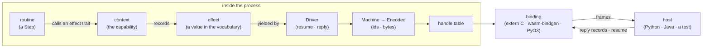

# Concepts

> [!NOTE]
> _Status:_ current. The terms `sans-effort` uses and how they connect. The other documents give the reasoning; this one is the map.

## The Whole Picture

A routine calls methods on its context. A native context makes each call a real future, and nothing else in the picture exists. A reifying context records each call as an effect; a driver yields the effects; the layers below turn handles into ids and values into bytes; and a host on the other side of a binding performs them and replies.

## The Routine Side

- _Routine._ Short for _effect routine_: an ordinary `async fn` whose every wait is an effect answered by whoever drives it. It asks for traits, not effects, and cannot tell how it is being run. Written as a type implementing `Step`.
- _`Step`._ The shape of a routine: `step` is one iteration of its loop, returning `ControlFlow`; `run` repeats it until it breaks.
- _Effect trait._ One verb a routine may use — `Sleep`, `ReadLine`, the demo's `Lookup` — one method each. A routine names the traits it uses as bounds on its context, and that list is everything it can do. The standard ones are in `sans-effort-effects`; an application adds its own.
- _Context._ The value a routine is given that implements its effect traits, and decides what each call does. The context _is_ the capability: a routine can do exactly what its context lets it, and has no other way to reach the world. A _native context_ (`TokioCtx`, the demo's `JsCtx`) makes each call a real future; a _reifying context_ (`Ctx<E>`) records each call as an effect for a host.
- _Child._ A routine started by another through `Spawn` or `SpawnPinned`. It runs as a machine of its own; it talks to its parent over ordinary channels, created by the parent and handed over at birth.

## Effects

- _Effect._ A value describing one thing a routine needs from its host. It is _told_ (`tell`: a message, no reply — `WriteLine`) or _asked_ (`ask`: a wait, answered by the host — `ReadLine`).
- _Request._ What an asked effect asks for, as a value: `SleepEffect(duration)`. A request type implements `Ask`, which names its _answer_.
- _Answer._ What the routine's wait resolves to: `()`, `String`, `Result<String, ReadLineError>`. Every answer crosses the wire as one of four sealed _wire kinds_ — `str`, `u64`, `unit`, `bytes` — the `Reply` menu; `Result` and `Option` cross as bytes. A wire value that does not decode as the awaited answer is refused before the routine sees it.
- _`ReplyHandle<A>`._ The typed, single-use capability to answer one wait with an `A`. It travels inside the effect to whoever performs it. In Rust, the host replies through it; over an ABI, through its id.
- _`Asked<R>`._ A request in flight: the request, and the handle that answers it.
- _Vocabulary._ The host's effect type: an enum with a variant per effect it offers (the demo's `Full`, or the smaller `Quiet`) and a `From` impl per variant. `Ctx<E>` implements an effect trait exactly when `E` can carry its effect, so a routine needing more than a vocabulary offers does not compile. Offering less is _attenuation_.
- _`Asking` → `Awaiting`._ `outbox.ask(…)` returns an `Asking`: lazy, like any Rust future — nothing has happened. Awaiting it turns it into an `Awaiting`, and that step mints the request's id, builds the effect, and records it. So ids are gapless and increase in the order effects are recorded; a request dropped before it was awaited never has one. An `Awaiting` dropped before its reply — the losing side of a `select` — is _closed_, and the host is told.

### Two Ways to Build an Effect

The mechanism has one: a closure that builds the effect around a fresh handle, `outbox.ask(Effect::Lookup)`. The caller names a variant of one concrete enum, so it serves one vocabulary — the fewest lines, when there is one vocabulary and you own it.

`sans-effort-effects` adds the other, on top: the request is a value (`LookupEffect(name)`) naming its answer through `Ask`, and a context generic over the vocabulary requires only `E: From<Asked<LookupEffect>>`. One impl then serves every host that carries the effect, whatever else its vocabulary holds. This is the opt-in layer; the closure form underneath is unchanged.

## Driving

- _Driver._ What turns a routine into something a host can step without polling it: `resume()` runs it to its next wait (the first call begins it), and `reply(handle, answer)` delivers one answer and runs it on. Each returns a _yield_: the effects recorded, and the ids of requests closed.
- _Status._ Where a routine stopped: `Awaiting` a reply, `Complete`, or `Idle` — waiting on nothing the host was asked for, but on something inside the process, such as a channel another routine sends on.
- _Wake._ What an idle routine's waker does when its wait may be over. The driver calls the hook set by `on_wake`, once per wait; the host layer turns that into a `woke` frame naming the machine. Resuming an idle machine is always harmless, so a wake only saves the host from guessing.
- _Machine._ A driven routine — root or child — with its own handle, its own request ids, and its own status. Most machines may move between threads; a _pinned_ one, whose future is not `Send`, stays on the thread that first resumed it.
- _`Machine` and `Encoded`._ The host layer's two forms of a machine. `Machine` is typed: it keeps the outstanding handles by id, so a host replies with an id and a value, and the reply's kind is checked. `Encoded` is the same calls over bytes: one reply record in, frames out.
- _`HostEffect` and `View`._ What a vocabulary implements to cross: `split` turns an effect into its _view_ — the same effect with its handle replaced by an id — and the handle to keep. `Encode` writes the view as bytes.
- _Frame._ One item of a call's output: `u8 kind · u32 len · payload`. The kinds are tell, ask (its payload ends with the request id), closed (an id the routine abandoned), and woke (a machine handle). A _reply record_ is what a host sends back: `kind · id · payload`.
- _Handle table._ Machines behind `u64` handles, for hosts that hold no Rust value: `new`, `resume`, `reply`, `wakes`, `free`.
- _Binding._ The thin, application-written layer a foreign host calls: one `extern "C"` (or wasm-bindgen, or `PyO3`) function per table call, plus a constructor per _root routine_ — a routine the binding can start, as the demo's `greeter_new_*` start the greeter and the rest. Children are not exported; they are spawned.
- _Host._ Whoever polls: tokio or the JS event loop for a native context; for a reifying one, whoever drives the machines — a Python loop, a Java thread pool, a test, the `testing` runner. The host performs effects, replies, resumes woken machines, and decides what runs when. The library has no scheduler.
- _End and stall._ With no call to make, no request outstanding, and nothing from `wakes()`, a host has reached one of two ends: every machine completed, or some can never progress — a deadlock, reported rather than hung on.

## The Wasm Component Analogy

For readers who know the Wasm component model, the pieces line up closely:

| Component model                       | `sans-effort`                                                                |
|---------------------------------------|------------------------------------------------------------------------------|
| A component's imports                 | A routine's effect-trait bounds                                              |
| A component's exports                 | The root routines a binding can construct                                    |
| A WIT interface                       | A vocabulary: the effects a host offers, and their answers                   |
| The canonical ABI                     | `HostEffect`, `View`, `Encode`, and the frame and reply-record formats       |
| Generated bindings                    | The binding: one wrapper per call, and a constructor per root routine        |
| Instantiating with fewer imports      | Attenuation: a smaller vocabulary, where a routine needing more fails to build |

Where it breaks:

- _Not every routine is an export._ Any type implementing `Step` is a routine; only those a binding constructs are visible from outside. Being exported is the binding's property, not the type's.
- _The encoding layer is not the routines._ `sans_effort::boundary` is the canonical-ABI half — how effects cross. Routines and their traits know nothing of it.
- _One address space._ Components are isolated from each other; routines in one binding share a process, and talk over ordinary channels. Isolation between routines is the capability discipline of safe Rust, not memory separation (see [`capabilities`](capabilities.md)).

## Where to Read More

- [`assumptions`](assumptions.md): what the design takes for granted about hosts, routines, and targets.
- [`effects`](effects.md): the standard effect traits and their native side.
- [`channels`](channels.md): spawning, channels, `IDLE`, and `woke` frames.
- [`cancellation`](cancellation.md): `select`, closed requests, and what abandoning each effect costs.
- [`capabilities`](capabilities.md): the context as a capability, and what an honest host guarantees.
- [`../ABI.md`](../ABI.md): the contract in full; [`../spec/host_protocol.qnt`](../spec/host_protocol.qnt): the host protocol, model-checked.
